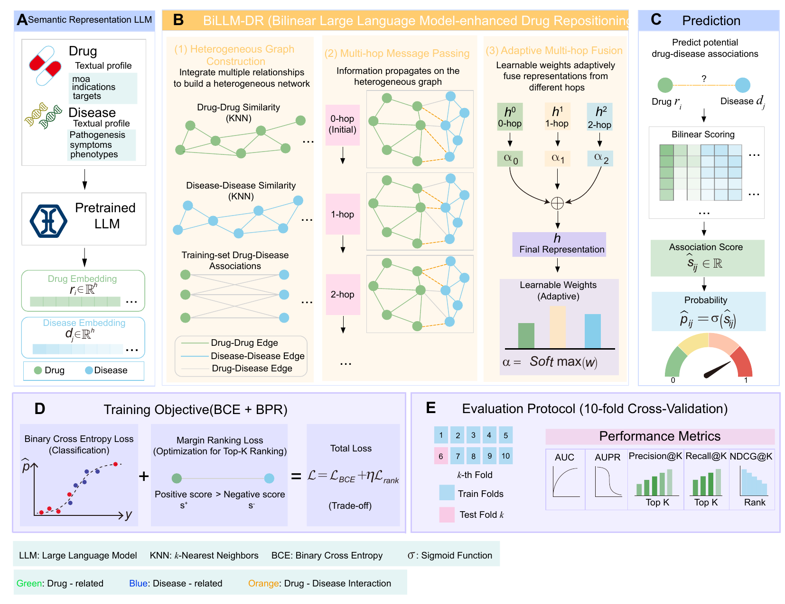

# BiLLM-DR

**BiLLM-DR** (*Bilinear LLM-Enhanced Heterogeneous Graph Learning for Drug Repositioning*) is a drug-disease association prediction framework that integrates large-language-model-derived semantic representations, heterogeneous graph learning, and bilinear interaction scoring for computational drug repositioning.

The framework uses textual descriptions of drugs and diseases as semantic inputs, propagates these representations over drug similarity, disease similarity, and training-set drug-disease association graphs, and predicts disease-query-specific association probabilities with a bilinear scorer.

<p align="center">
  
</p>

The original vector workflow figure is also provided as `assets/Figure1.pdf`.

## Highlights

- BiLLM-DR integrates LLM-derived semantics with heterogeneous graph learning.
- A bilinear scorer models disease-query-specific drug-disease compatibility.
- BiLLM-DR improves AUPR and Top-K prioritization on Cdataset and Fdataset.
- Ablation confirms the value of semantic features and DropEdge regularization.
- An asthma case study supports biologically plausible repositioning hypotheses.

## Repository Structure

```text
BiLLM-DR/
|-- billm_dr/                        # Functional modules
|   |-- preprocessing.py              # Preprocess Cdataset/Fdataset-style .mat datasets
|   |-- feature_extraction.py          # LLM-based drug/disease semantic embedding extraction
|   |-- data_split.py                 # Strict splitting and graph construction
|   |-- model.py                      # Heterogeneous graph model and bilinear scorer
|   |-- train_eval.py                 # Single-run and 10-fold training/evaluation
|   |-- metrics.py                    # Ranking metrics
|   |-- preprocessing1.py             # CSV-style dataset preprocessing for Bdataset/Rdataset
|   |-- feature_extraction1.py         # Feature extraction for CSV-style datasets
|   |-- data_split1.py                # Splitting for CSV-style datasets
|   `-- train_eval1.py                # Evaluation for CSV-style datasets
|-- data/                             # Empty data scaffold; real datasets are not included
|-- assets/                           # Workflow figure
|-- docs/                             # Highlights and notes
|-- main.py                           # Main entry for Cdataset/Fdataset
|-- Bdataset.py                       # Entry for Bdataset/Rdataset-style CSV datasets
|-- run_ablations.py                  # Ablation experiments
|-- parameter_sensitivity.py          # Parameter sensitivity experiments
|-- random_seed_stability.py          # Random-seed stability experiments
|-- topk_metrics_from_predictions.py  # Top-K ranking metrics
`-- requirements.txt
```

## Data and Model Files

Large files are intentionally **not** included in this GitHub package, including datasets, processed caches, extracted `.npy` features, trained weights, logs, result tables, and local LLM checkpoints.

Prepare the following structure before running:

```text
data/
|-- Cdataset/
|   |-- Cdataset.mat
|   |-- drug_desc.csv
|   `-- disease_desc.csv
|-- Fdataset/
|   |-- Fdataset.mat
|   |-- drug_desc.csv
|   `-- disease_desc.csv
`-- LLM/
    `-- Qwen/Qwen3-8B/               # Or set MODEL_PATH to another local LLM path
```

The code reads paths from environment variables, so datasets and LLM checkpoints can also be stored outside the repository.

## Installation

```bash
conda create -n billm-dr python=3.10 -y
conda activate billm-dr
pip install -r requirements.txt
```

Install the correct PyTorch build for your CUDA version if GPU acceleration is needed.

## Quick Start

Run a 10-fold cross-validation experiment on Fdataset:

```bash
DATA_ROOT=/path/to/data DATASET_NAME=Fdataset MODEL_PATH=/path/to/Qwen3-8B RUN_MODE=10-fold python main.py
```

Run a single validation/test split:

```bash
DATA_ROOT=/path/to/data DATASET_NAME=Cdataset RUN_MODE=single NEG_RATIO=90 POS_WEIGHT=12 BPR_WEIGHT=0.3 KNN_K=15 python main.py
```

Recommended settings used in the manuscript:

```bash
NEG_RATIO=90
POS_WEIGHT=12
BPR_WEIGHT=0.3
KNN_K=15
HIDDEN_DIM=512
DROPOUT=0.5
EDGE_DROP=0.25
LR=1e-4
WEIGHT_DECAY=5e-4
```

## Experiments

Ablation study:

```bash
DATA_ROOT=/path/to/data DATASET_NAME=Fdataset NUM_FOLDS=10 python run_ablations.py
```

Parameter sensitivity:

```bash
PROJECT_ROOT=$(pwd) DATASET_NAME=Cdataset python parameter_sensitivity.py
```

Random seed stability:

```bash
PROJECT_ROOT=$(pwd) DATASETS=Cdataset,Fdataset SEEDS=1,7,21,42,2024 python random_seed_stability.py
```

Top-K metrics from saved predictions:

```bash
python topk_metrics_from_predictions.py --help
```

## Main Results Reported in the Manuscript

In ten-fold cross-validation, BiLLM-DR achieved AUC/AUPR values of **0.9737/0.7052** on Cdataset and **0.9669/0.6273** on Fdataset. These results indicate that combining LLM-derived semantic features, heterogeneous graph propagation, and bilinear scoring improves drug-disease candidate prioritization under sparse and class-imbalanced evaluation settings.

## Citation

If this repository is useful for your research, please cite the associated manuscript when it becomes available.
